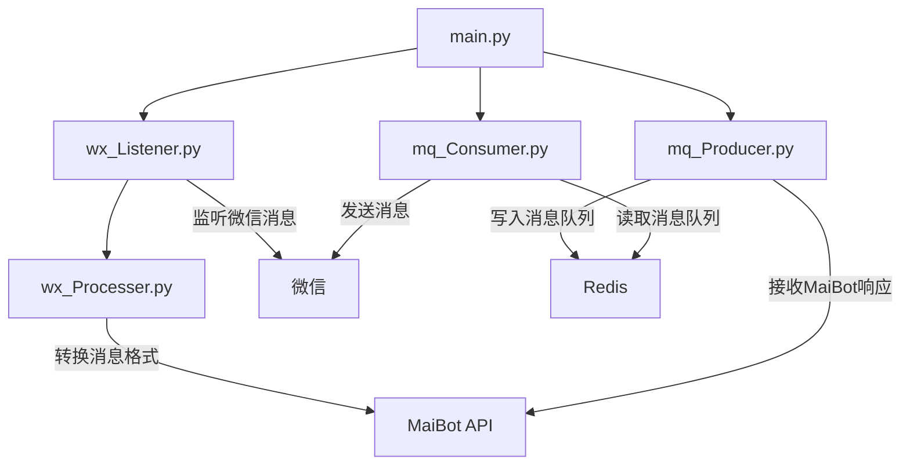

## 架构简述

将 maibot 视为独立的机器人，由另一个机器人与她交互实现消息交互
这里的另一个机器人在 qq 平台即为 NapCat QQ

因此有了 wechat 端实现部署 maibot 的可能，将 NapCat QQ 替换为新的框架实现监控微信消息，发送消息就可以完成微信分麦。

由于 wechat 风控比 QQ 更加严格，为了防止账号被封禁，本项目选择的方案基于微软的 UI 自动化测试框架。使用了开源项目 [wxauto](https://github.com/cluic/wxauto) 进行实现，该项目区别于 RPA 框架，由微软推出的底层 app UI 元素定位的方式实现自动化操作，以非侵入式（区别于 hook 框架）监听微信的方式实现。

整体架构如下：


消息传递逻辑可以简单理解为：
Wechat -> Maibot (wx_Listener、wx_Processer)
Maibot 思考后
Maibot -> Wechat （mq_Producer、mq_Consumer）

## 方式一：同设备

1. 先部署 maibot，当 maibot 可以独立运行时，视为有效
2. 安装 redis
3. 下载 [WeMai](https://github.com/aki66938/WeMai)
```bash
git clone https://github.com/yourusername/wemai.git
cd wemai
pip install -r requirements.txt
cp .env.example .env
# 编辑.env文件，配置你的环境变量
python main.py
```

**环境变量配置**

在MaiBot 项目中和 WeMai 项目的环境变量存在映射关系
1. **Platforms**: 位于 MaiBot 的 65-66 行，将地址修改为 WeMai 的 .env 中配置的API_HOST 和API_PORT（22-23 行），如果在 WeMai 中修改了 33 行的 PLATFORM_ID，则需要调整的是 MaiBot 中 65-66 行的变量，例如（nonebot-qq）
2. 将 WeMai 中的第 15 行，MAIBOT_API_URL 的地址，设置为 MaiBot 中 env 文件第一行和第二行设定的地址和端口即可
3. 关于 redis，可以本地部署也可以远端部署，确定好自己的 URL 即可

## 方式二：不同设备

如果仔细阅读前面部分其实不难发现，两个项目就是各自独立的项目，就像 nonebot-qq 和 maibot 一样。二者是通过 api 通信的。

因此，方式二不在赘述具体的部署步骤，只需将两个项目配置文件中的监听地址修改为 0.0.0.0，然后检查防火墙是否放行对应端口即可。


## 写在最后

本方式采用非侵入式监听消息及拟人化的操作降低了被微信抓住特征的可能性，但
即便再小的可能也不是没有可能，请珍惜您的微信账号，胆小请不要使用本方式部署